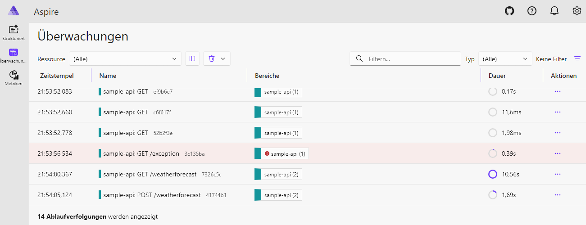
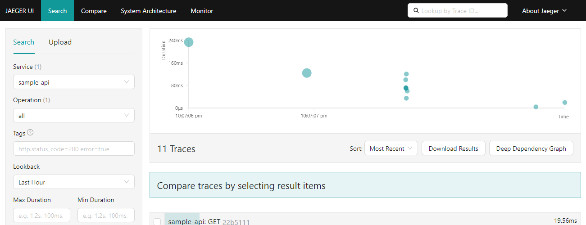

[](https://github.com/thorstenalpers/OpenTelemetryExtension.Configuration)

[](https://github.com/thorstenalpers/OpenTelemetryExtension.Configuration/actions/workflows/ci.yml)
[](https://coveralls.io/github/thorstenalpers/OpenTelemetryExtension.Configuration?branch=develop)
[](https://www.nuget.org/packages/OpenTelemetryExtension.Configuration)
[](https://www.nuget.org/packages/OpenTelemetryExtension.Configuration)
[](./LICENSE)

Configurable OpenTelemetry setup for .NET applications providing **tracing, metrics, and logging** via OTLP, configurable through code or `appsettings.json`.

---

## ✨ Features

- **One-call setup** — tracing, metrics and logging via a single `AddTelemetry()`, configured from `appsettings.json` or code
- **All three signals over OTLP** — HTTP/protobuf or gRPC, to any OTLP-compatible backend
- **Built-in instrumentation** — ASP.NET Core, `HttpClient`, SQL Client and .NET runtime metrics, each toggleable
- **Sensible defaults** — sampling, health-check path exclusion and exception recording work out of the box
- **Startup validation** — misconfiguration fails fast with a clear error
- **Extensible** — `ConfigureTracing`/`ConfigureMetrics`/`ConfigureLogging` hooks for custom sources, meters and providers
- **Broad target support** — `netstandard2.0` and `net10.0`

---


## 📦 Installation

```bash
dotnet add package OpenTelemetryExtension.Configuration
```

---

## 🚀 Quick Start

### 1. Register

```csharp
builder.Services.AddTelemetry(builder.Configuration);
```

### 2. Configure (`appsettings.json`)

```json
{
  "Telemetry": {
    "Enabled": true,
    "Endpoint": "http://localhost:4318",
    "ServiceName": "my-api"
  }
}
```

That's it — tracing, metrics and logging are exported via OTLP.

---

## ⚙️ Configuration

All options live under the `Telemetry` key in `appsettings.json`.

| Property | Type | Default | Description |
|---|---|---|---|
| `Enabled` | `bool` | `false` | Must be `true` to activate telemetry. |
| `Endpoint` | `Uri` | *(required)* | OTLP collector endpoint, e.g. `http://localhost:4318`. |
| `Headers` | `string` | `""` | Exporter headers. Format: `key1=value1,key2=value2`. |
| `Protocol` | `string` | `HttpProtobuf` | `HttpProtobuf` (port 4318) or `Grpc` (port 4317). |
| `ServiceName` | `string?` | `null` | Service name shown in the backend. |
| `ResourceAttributes` | `object` | `{}` | Extra resource attributes, e.g. `{ "deployment.environment": "production", "team": "backend" }`. |
| `SampleRatio` | `double` | `1.0` | Fraction of traces to sample. `0.1` = 10%, `1.0` = all. |
| `EnableTracing` | `bool` | `true` | Enables distributed tracing. |
| `EnableMetrics` | `bool` | `true` | Enables metrics collection. |
| `EnableLogging` | `bool` | `true` | Enables log export via OTLP. |
| `EnableAspNetCoreInstrumentation` | `bool` | `true` | Instruments incoming HTTP requests. |
| `EnableHttpClientInstrumentation` | `bool` | `true` | Instruments outgoing `HttpClient` requests. |
| `EnableSqlClientInstrumentation` | `bool` | `false` | Instruments SQL calls. Opt-in — not all apps use SQL. |
| `EnableRuntimeInstrumentation` | `bool` | `true` | Collects GC, memory and thread pool metrics. |
| `RecordExceptions` | `bool` | `true` | Records exception stack traces on spans. |
| `ExcludedPaths` | `string[]` | `["/health"]` | Paths excluded from tracing. |
| `IncludeScopes` | `bool` | `true` | Includes log scopes in exported log records. |
| `IncludeFormattedMessage` | `bool` | `true` | Includes the formatted message in exported log records. |

> `ConfigureTracing`, `ConfigureMetrics` and `ConfigureLogging` are code-only callbacks — see [Code configuration](#-code-configuration).

### Full example

Every key with its **default** value (only `Enabled` and `Endpoint` are required to get started):

```jsonc
{
  "Telemetry": {
    "Enabled": false,                          // master switch — set true to activate
    "Endpoint": "http://localhost:4318",       // OTLP collector endpoint (required)
    "Headers": "",                             // exporter headers: "key1=value1,key2=value2"
    "Protocol": "HttpProtobuf",                // "HttpProtobuf" (4318) or "Grpc" (4317)
    "ServiceName": null,                        // service name shown in the backend
    "ResourceAttributes": {},                   // extra attributes, e.g. { "deployment.environment": "production" }
    "SampleRatio": 1.0,                         // 0.1 = 10% of traces, 1.0 = all
    "EnableTracing": true,                      // distributed tracing
    "EnableMetrics": true,                      // metrics collection
    "EnableLogging": true,                      // log export via OTLP
    "EnableAspNetCoreInstrumentation": true,    // incoming HTTP requests
    "EnableHttpClientInstrumentation": true,    // outgoing HttpClient requests
    "EnableSqlClientInstrumentation": false,    // SQL calls (opt-in)
    "EnableRuntimeInstrumentation": true,       // GC, memory, thread pool metrics
    "RecordExceptions": true,                   // exception stack traces on spans
    "ExcludedPaths": [ "/health" ],             // paths excluded from tracing
    "IncludeScopes": true,                      // log scopes in exported records
    "IncludeFormattedMessage": true             // formatted message in exported records
  }
}
```

---

## 🧩 Code Configuration

Configure entirely in code instead of `appsettings.json`:

```csharp
builder.Services.AddTelemetry(o =>
{
    o.Endpoint        = new Uri("http://localhost:4318");
    o.ServiceName     = "my-api";
    o.ResourceAttributes = new() { ["deployment.environment"] = "production" };
    o.SampleRatio     = 0.1;

    // Code-only: register additional instrumentation
    o.ConfigureTracing = tracing => tracing.AddSource("MyApp");
    o.ConfigureMetrics = metrics => metrics.AddMeter("MyApp");
    o.ConfigureLogging = logging => logging.AddConsole();
});
```

Or bind `appsettings.json` first and layer code-only options on top — both
sources are combined, and bound values can still be overridden in the callback:

```csharp
builder.Services.AddTelemetry(builder.Configuration, o =>
{
    // Everything from appsettings.json is already bound here.
    o.ConfigureTracing = tracing => tracing.AddSource("MyApp");
    o.ConfigureMetrics = metrics => metrics.AddMeter("MyApp");
});
```

### The `Configure*` hooks — Sources & Meters

The three callbacks are the extension points for **your own** telemetry. The
built-in instrumentation (ASP.NET Core, `HttpClient`, SQL, runtime) is wired up
automatically; these hooks let you add the signals your application emits itself.

| Hook | Builder | Used to register |
|---|---|---|
| `ConfigureTracing` | [`TracerProviderBuilder`](https://opentelemetry.io/docs/languages/net/instrumentation/#traces) | **Activity Sources** via `AddSource("Name")` |
| `ConfigureMetrics` | [`MeterProviderBuilder`](https://opentelemetry.io/docs/languages/net/instrumentation/#metrics) | **Meters** via `AddMeter("Name")` |
| `ConfigureLogging` | [`ILoggingBuilder`](https://learn.microsoft.com/dotnet/api/microsoft.extensions.logging.iloggingbuilder) | extra logging providers, filters, etc. |

**What is a Meter?**
A [`Meter`](https://learn.microsoft.com/dotnet/api/system.diagnostics.metrics.meter)
(from `System.Diagnostics.Metrics`) is the factory you create instruments
(counters, histograms, gauges) from. Each `Meter` has a **name**, and OpenTelemetry
only collects metrics from meters you have explicitly registered with
`AddMeter("That.Name")`. Without that call, your custom metrics are never exported.

```csharp
// 1. Create a Meter and an instrument somewhere in your app
private static readonly Meter Meter = new("MyApp.Orders");
private static readonly Counter<long> OrdersPlaced =
    Meter.CreateCounter<long>("orders.placed");

// ... later
OrdersPlaced.Add(1);

// 2. Register the meter's name so it gets exported
o.ConfigureMetrics = metrics => metrics.AddMeter("MyApp.Orders");
```

**What is a Source?**
An [`ActivitySource`](https://learn.microsoft.com/dotnet/api/system.diagnostics.activitysource)
is the tracing equivalent: it creates `Activity` objects (= spans). Register its
name with `AddSource("MyApp")` so your custom spans are sampled and exported.

```csharp
private static readonly ActivitySource Activity = new("MyApp");

using var span = Activity.StartActivity("ProcessOrder");
// ... work being traced

o.ConfigureTracing = tracing => tracing.AddSource("MyApp");
```

> The string passed to `AddMeter`/`AddSource` must **exactly match** the name you
> gave the `Meter`/`ActivitySource` — that name is how OpenTelemetry routes the
> data.

---

## 📚 References

- **OpenTelemetry .NET** — [official docs](https://opentelemetry.io/docs/languages/net/)
  · [GitHub](https://github.com/open-telemetry/opentelemetry-dotnet)
- **.NET observability (Microsoft Learn)**
  — [Metrics](https://learn.microsoft.com/dotnet/core/diagnostics/metrics)
  · [Distributed tracing](https://learn.microsoft.com/dotnet/core/diagnostics/distributed-tracing)
  · [Logging](https://learn.microsoft.com/dotnet/core/extensions/logging)
- **APIs** — [`Meter`](https://learn.microsoft.com/dotnet/api/system.diagnostics.metrics.meter)
  · [`ActivitySource`](https://learn.microsoft.com/dotnet/api/system.diagnostics.activitysource)
- **OTLP exporter** — [configuration reference](https://opentelemetry.io/docs/languages/net/exporters/#otlp)
  · [environment variables](https://opentelemetry.io/docs/specs/otel/configuration/sdk-environment-variables/)

---

## 🔌 Running Locally with a Backend

The [sample project](./src/OpenTelemetryExtension.Configuration.Sample) ships a
ready-to-run configuration for every supported backend. Each backend has:

1. an **infrastructure start script** (Docker Compose or Helm) in [`infrastructure/`](./infrastructure),
2. a **launch profile** that selects the matching `appsettings.<env>.json`,
3. a **UI** where the exported traces, metrics and logs show up.

### Steps

1. **Start the backend infrastructure** — run the script for your backend (see table).
   - Docker scripts live in [`infrastructure/docker`](./infrastructure/docker) and need Docker.
   - Helm scripts live in [`infrastructure/helm`](./infrastructure/helm) and need a local Kubernetes cluster (e.g. k3s in WSL2).
2. **Run the sample** with the matching profile:
   ```bash
   cd src/OpenTelemetryExtension.Configuration.Sample
   dotnet run --launch-profile "Start Aspire"
   ```
   Or pick the profile from the run dropdown in Visual Studio / Rider.
3. **Generate traffic** — the app opens Swagger at `https://localhost:5073/swagger`; call an endpoint.
4. **Open the backend UI** (see table) to inspect the telemetry.

### Backend overview

| Backend | Start infrastructure | Launch profile | Backend UI |
|---|---|---|---|
| .NET Aspire Dashboard | `infrastructure/docker/docker-install-aspire-dashboard.cmd` *(or Helm: `helm/helm-install-aspire-dashboard.cmd`)* | `Start Aspire` | <http://localhost:31888> |
| Jaeger | `infrastructure/docker/docker-install-jaeger.cmd` | `Start Jaeger` | <http://localhost:16686> |
| OpenObserve | `infrastructure/helm/helm-install-openobserve.cmd` | `Start OpenObserve Http` / `Start OpenObserve Grpc` | <http://localhost:30117> (`admin@web.de`/`admin`) |

> **Tip — viewing logs in the Aspire Dashboard:** after starting the app with the
> `Start Aspire` profile, open <http://localhost:31888>, then go to the
> **Structured** (logs), **Traces** or **Metrics** tab. Data appears as soon as
> you hit a Swagger endpoint.

---

## ⚙️ Backend Configurations

These are the exact `appsettings.<env>.json` files used by the sample's launch profiles.

### .NET Aspire Dashboard — `appsettings.aspire.json`

The dashboard requires an API key on the OTLP endpoint (`x-otlp-api-key`). The
gRPC endpoint is exposed on NodePort `31889` (Helm) or host port `31889` (Docker).

```json
{
  "Telemetry": {
    "Protocol": "Grpc",
    "Endpoint": "http://localhost:31889",
    "Headers": "x-otlp-api-key=aspire"
  }
}
```

Traces, metrics and logs from the sample app shown live in the Aspire Dashboard UI:



### Jaeger — `appsettings.jaeger.json`

```json
{
  "Telemetry": {
    "Protocol": "Grpc",
    "Endpoint": "http://localhost:4317"
  }
}
```

Traces from the sample app shown in the Jaeger UI:



### OpenObserve — HTTP/protobuf — `appsettings.openobserve-http.json`

```json
{
  "Telemetry": {
    "Protocol": "HttpProtobuf",
    "Endpoint": "http://localhost:30117/api/default",
    "Headers": "Authorization=Basic <base64>,stream-name=default"
  }
}
```

The same telemetry explored in the OpenObserve UI:


---

## 🤝 Contributing

See [CONTRIBUTING.md](./CONTRIBUTING.md).

## 🐛 Report a Bug

[Open an issue](https://github.com/thorstenalpers/OpenTelemetryExtension.Configuration/issues).
